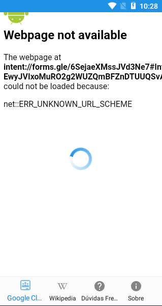

# Revisão

Tarefa | Finalizada? |
:-----:|:-----------:|
[Enviar o consumo de dados patrocinados para o elasticsearch](https://github.com/GCES-Escola-em-Casa-2020-2/wiki/issues/15) | |
[Criar um método para enviar requisição a cada segundo](https://github.com/GCES-Escola-em-Casa-2020-2/wiki/issues/14)| |
[Adicionar barra de controle de histórico](https://github.com/GCES-Escola-em-Casa-2020-2/wiki/issues/13)| |
[Verificar mais formas de abrir docs](https://github.com/GCES-Escola-em-Casa-2020-2/wiki/issues/12) | |
[Verificar mais formas de inserir formulário](https://github.com/GCES-Escola-em-Casa-2020-2/wiki/issues/11) | :heavy_check_mark: |
[Adicionar a funcionalidade de tirar foto](https://github.com/GCES-Escola-em-Casa-2020-2/wiki/issues/8) | |

## Enviar o consumo de dados patrocinados para o elasticsearch

## Criar um método para enviar requisição a cada segundo

## Adicionar barra de controle de histórico

## Verificar mais formas de abrir docs

## Verificar mais formas de inserir formulário

O aplicativo apresenta alguns links que não estão sendo redirecionados para lugar algum, apenas apresenta a seguinte tela:

A solução encontrada para o problema apresentado foi tentar criar uma intercepção entre todos os links que são clicáveis dentro do aplicativo. Para tal, utilizamos uma regex e consultamos a URL do rollback que estava dentro da requisição. 

## Adicionar a funcionalidade de tirar foto

## Histórico de Revisão

Data | Versão | Descrição | Autor |
:---:|:------:|-----------|-------|
22/03|0.1 | Criação da Página | [Geise Saunier](https://github.com/GeiseSaunier) |
22/03|0.1 | Verificar mais formas de inserir formulário | [Pedro Igor](https://github.com/pedroeagle), [Geise Saunier](https://github.com/GeiseSaunier) |
22/03|0.1 | Verificar mais formas de abrir docs | [Pedro Igor](https://github.com/pedroeagle), [Geise Saunier](https://github.com/GeiseSaunier) |
