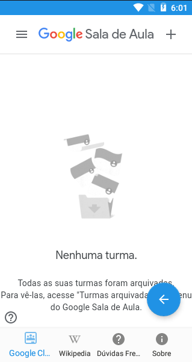
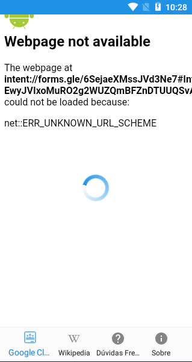
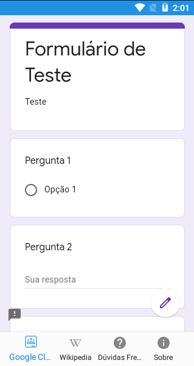

# Revisão

Tarefa | Finalizada? |
:-----:|:-----------:|
[Enviar o consumo de dados patrocinados para o elasticsearch](https://github.com/GCES-Escola-em-Casa-2020-2/wiki/issues/15) | |
[Criar um método para enviar requisição a cada segundo](https://github.com/GCES-Escola-em-Casa-2020-2/wiki/issues/14)| |
[Adicionar barra de controle de histórico](https://github.com/GCES-Escola-em-Casa-2020-2/wiki/issues/13)| |
[Verificar mais formas de abrir docs](https://github.com/GCES-Escola-em-Casa-2020-2/wiki/issues/12) | |
[Verificar mais formas de inserir formulário](https://github.com/GCES-Escola-em-Casa-2020-2/wiki/issues/11) | :heavy_check_mark: |
[Adicionar a funcionalidade de tirar foto](https://github.com/GCES-Escola-em-Casa-2020-2/wiki/issues/8) | |

## Enviar o consumo de dados patrocinados para o elasticsearch

## Criar um método para enviar requisição a cada segundo

## Adicionar barra de controle de histórico

Ao utilizar o webview do app em alguns momentos o app não responde mais aos toques dentro do navegador e ao pressionar o botão de voltar nada acontece ou o app simplesmente fecha. Para solucionar isso é necessário clicar em outro item na barra de navegação e então retornar a página que estava sendo utilizada. Como solução foi adicionado um botão auxiliar flutuante que permite que o usuário volte até a página anterior sem muitos problemas além de não fechar o app ao realizar tal ação. 
 

O PR foi aberto no repositório oficial e está disponível [aqui](https://github.com/Escola-em-Casa/android-escola-em-casa/pull/60).

## Verificar mais formas de abrir docs

## Verificar mais formas de inserir formulário

Links encurtados para formulários são redirecionados para uma página que não funciona, é apresentada a seguinte tela: 
 
Alguns outros links até abrem porém em um app externo, instalado no dispositivo, e não deveria ser o comportamento do app.

A solução encontrada para o problema apresentado foi realizar uma interceptação entre todos os links que são clicáveis dentro do aplicativo. Para tal, utilizamos uma regex para links encurtados e consultamos a URL do rollback que estava dentro do header 'location' no elemento S.browser_fallback_url.

Realizando essa alteração foi possível abrir o formulário com link encurtado normalmente: 
 

Sendo assim, foram mapeadas as seguintes formas de inserir formulários: 
    - Link completo do formulário no formato `https://docs.google.com/forms/d/${ID_DO_FORMULARIO}` 
    - Link encurtado no formato `https://forms.gle/${ID_ENCURTADO_DO_FORMULARIO}`. Corrigido nessa issue, o PR foi aberto no repositório oficial e pode ser encontrado [aqui](https://github.com/Escola-em-Casa/android-escola-em-casa/pull/59).  
Obs: Links no formato `https://drive.google.com/file/d/${ID_DO_FORMULARIO}` podem ser abertos porém o estudante não conseguirá responder ao questionário, este será apenas mostrado sem interação para respondê-lo. 

É necessário analisar se formulários inseridos sem link (como arquivo) no app funcionam como deveria. Porém a conta que temos acesso para testes não nos permite inserção de novos conteúdos. 

## Adicionar a funcionalidade de tirar foto

## Histórico de Revisão

Data | Versão | Descrição | Autor |
:---:|:------:|-----------|-------|
22/03|0.1 | Criação da Página | [Geise Saunier](https://github.com/GeiseSaunier) |
22/03|0.2 | Verificar mais formas de inserir formulário | [Pedro Igor](https://github.com/pedroeagle), [Geise Saunier](https://github.com/GeiseSaunier) |
22/03|0.3 | Verificar mais formas de abrir docs | [Pedro Igor](https://github.com/pedroeagle), [Geise Saunier](https://github.com/GeiseSaunier) |
24/03|1.0 | Atualiza issue de mais formas de inserir formulário | [Pedro Igor](https://github.com/pedroeagle), [Geise Saunier](https://github.com/GeiseSaunier) |
24/03|1.1 | Adiciona issue de botão de navegação no histórico | [Pedro Igor](https://github.com/pedroeagle) |
