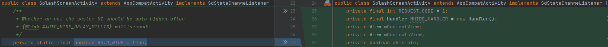
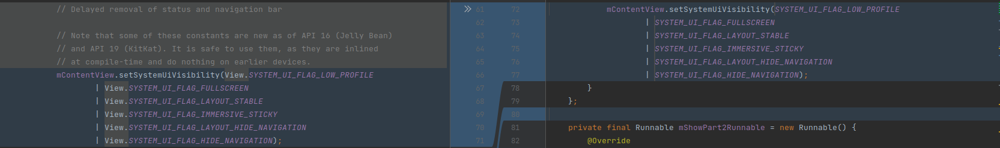
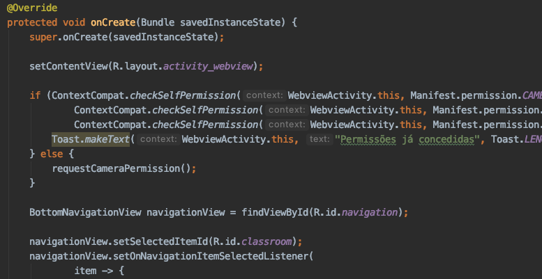
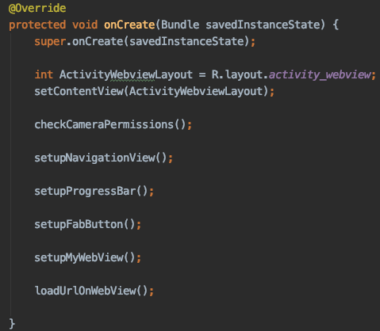
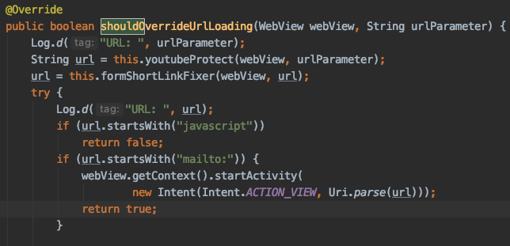
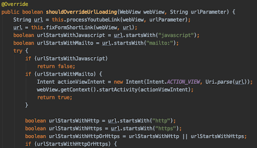
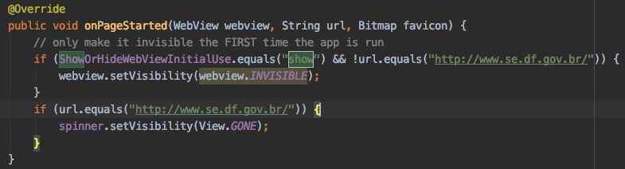
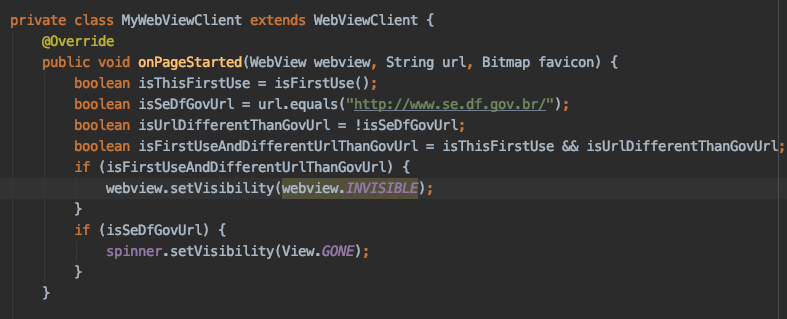

# Revisão

Tarefa | Finalizada? |
:-----:|:-----------:|
[MAIN ACTIVITY](https://github.com/GCES-Escola-em-Casa-2020-2/wiki/issues/16) | :x: |
[QUESTIONS ACTIVITY](https://github.com/GCES-Escola-em-Casa-2020-2/wiki/issues/26) | :heavy_check_mark: |
[ABOUT ACTIVITY](https://github.com/GCES-Escola-em-Casa-2020-2/wiki/issues/27) | :x: |
[MYAPPLICATION](https://github.com/GCES-Escola-em-Casa-2020-2/wiki/issues/28) | :heavy_check_mark: |
[SPLASH SCREEN ACTIVITY](https://github.com/GCES-Escola-em-Casa-2020-2/wiki/issues/29) | :heavy_check_mark: |
[WEB ACTIVITY](https://github.com/Escola-em-Casa/android-escola-em-casa/issues/68) | :heavy_check_mark: |
[INTEGRAR COM O CODE SMELLS](https://github.com/GCES-Escola-em-Casa-2020-2/wiki/issues/31) | :heavy_check_mark: |

## Splash Screen Activity

Na classe foram aplicadas técnicas de Clean Code para melhorar a leitura do código. Seguindo os padrões recomendados pela comunidade Java, as seguintes alterações foram realizadas:

* O nome das constantes sempre deve ser declarado em letras maiúsculas, separadas por underscores “_” no caso de existirem múltiplas palavras.
* Agrupar declarações de variáveis no começo da classe.
* Diminuir o número de comentários no código.
* Nomenclatura de métodos com nomes significativos.

### Exemplos de mudanças

 

 

Para ver todas as mudanças realizadas na classe basta ver esse [commmit](https://github.com/GCES-Escola-em-Casa-2020-2/android-escola-em-casa/commit/22edeca91a6ea14f3784b6e2f7000f4c8e943558).

## WebView Activity

Toda a classe foi refatorada com o objetivo de manter um código limpo e legível. O código que antes realizava diversas coisas simultaneamente passou a realmente contar uma história. O PR foi aberto para o repositório oficial e pode ser acessado [aqui](https://github.com/Escola-em-Casa/android-escola-em-casa/pull/69).

### Exemplos de mudanças
### Antes

### Depois

### Antes

### Depois

### Antes

### Depois

## MyApplication

Na classe foram aplicadas técnicas de Clean Code para melhorar a leitura do código. Seguindo os padrões recomendados pela comunidade Java, as seguintes alterações foram realizadas:

* Transformação de variáveis privadas para variáveis locais.
* Aplicação de métodos explicativos, seguindo o princípio da responsabilidade única.

### Antes 

### Depois

### Antes

### Depois

## Questions Activity

Na classe foram aplicadas técnicas de Clean Code para melhorar a leitura do código. Seguindo os padrões recomendados pela comunidade Java, as seguintes alterações foram realizadas:

* Aplicação de métodos explicativos, seguindo o princípio da responsabilidade única.

### Antes

### Depois

## Histórico de Revisão

Data | Versão | Descrição | Autor |
:---:|:------:|-----------|-------|
26/04|0.1 | Criação da Página | [Rafael Ribeiro](https://github.com/rafaelflarrn) |
05/05|1.0 | Adição das alterações realizadas sobre a WebviewActivity | [Pedro Igor](https://github.com/pedroeagle) |
11/05|1.1 | Adição das alterações realizadas sobre a MyApplication e Questions Activity | [Lucas Gomes](https://github.com/LGomees) |
15/05|1.2 | Adição de link para o PR no repositório oficial | [Pedro Igor](https://github.com/pedroeagle) |

