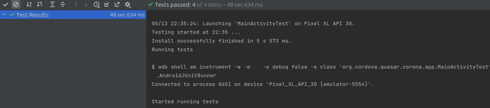

# Revisão

Tarefa | Finalizada? |
:-----:|:-----------:|
[Implementação de testes](colocar_link) | :heavy_check_mark: |
[Implementar Solid e Clean Code](colocar_link) | :heavy_check_mark: |
[Pesquisar viabilidade de utilização do Google Classroom Api](https://github.com/GCES-Escola-em-Casa-2020-2/wiki/issues/18) |:heavy_check_mark: |

## Pesquisar viabilidade de utilização do Google Classroom Api
A pesquisa foi realizada com objetivo de, por meio da api, realizar a submissão de atividades no Google Classroom. A partir dessa viabilidade utilizar o Google Drive Api e realizar então a submissão de fotos (uma issue atualmente sem solução do projeto).

### Passo a passo para criação e submissão de atividade
É possível realizar a submissão de atividades via classroom api. Isso pode ser utilizado para solucionar o problema ao submeter fotos nas atividades.
Passo a passo de como isso deve ser feito:

* **1** - Criar um projeto e uma autorização oauth respectiva aqui: console.cloud.google.com/apis/credentials

* **2** - Realizar o download do arquivo de credenciais dessa autorização oauth. Se trata de um arquivo .json
com as seguinte informações (é necessário obter todas): client_id, project_id, auth_uri, token_uri, 
auth_provider_x509_cert_url, client_secret, redirect_uris (esse pode ser um endereço localhost qualquer, 
o código de autorização fica disponível na url possibilitando acesso direto sem a criação de uma página 
de callback)

* **3** - Solicitar o token via oauth. O arquivo do passo anterior será utilizado na solicitação do token.json que pode ser solicitado seguindo
este guia: https://developers.google.com/classroom/guides/get-started. É possível realizar esta etapa em diversas
linguagens. É importante que sejam solicitadas todas os escopos dentro do classroom, isso é definido por meio 
do array: 
const SCOPES = ["https://www.googleapis.com/auth/classroom.courses", "https://www.googleapis.com/auth/classroom.coursework.me", 
"https://www.googleapis.com/auth/classroom.coursework.me.readonly", "https://www.googleapis.com/auth/classroom.coursework.students", 
"https://www.googleapis.com/auth/classroom.coursework.students.readonly"];

* **4** - Utilizar a api. Após solicitado o token.json é possível realizar qualquer requisição disponível na documetação passando sempre o arquivo de token.
O guia auxilia bastante a forma como esse token deve ser utilizado além dos endpoints e bodies. O token tem um curto prazo de validade, logo uma dificuldade
pode ser gerar esse token constantemente.
Link do guia: https://developers.google.com/classroom/guides/get-started

Na própria api é possível realizar consultas do id de todos os cursos, atividades e submissões para que sejam realizados os passos abaixo.

* **5** - Criar uma atividade. Para que uma atividade seja submetida via api esta precisa ser criada também via api.
Uma atividade pode ser criada da seguinte forma (exemplo em node): 
classroom.courses.courseWork.create({courseId: $idDaTurma, requestBody:{title: $tituloDaAtividade, workType: $tipoDeAtividade, state: 'PUBLISHED'}

* **6** - Realizar uma submissão. Assim que uma atividade é criada é criada também uma submissão para cada estudante. Esta submissão fica vazia até
que o estudante entregue a atividade. É possível então modificar os anexos de uma atividade sendo possível enviar um arquivo do drive (resolvendo 
o problema de subsmissão de imagens), video do youtube, link e um formulário. O exemplo abaixo envia um link como submissão.
await classroom.courses.courseWork.studentSubmissions.modifyAttachments({courseId: $idDaTurma, courseWorkId: $idDaAtividade, id: $idDaSubmissao, 
requestBody:{addAttachments:[{link:{url: $url, title: $tituloDaUrl}}]}})

## Implementar SOLID e Clean Code

Levando em consideração alguns arquivos que não tinham passado por uma analise de clean code e aplicação dos princípios do SOLID, os arquivos AboutActivity e MainActivity foram analisados e filtrados de acordo com as aplicações possíveis. Junto a isso, o método setupNavigationView que foi criado na sprint anterior sofreu uma alteração para que posterioremente seja modificado para uma classe abstrata, tendo em vista que a mesma é utilizada em basicamente 4 arquivos de maneira adaptada.

### Antes


### Depois 


## Implementação de testes

Para que o código fosse testado com mais facilidade, o app deveria ter sido desenvolvido em relação a módulos, em que cada módulo representa uma tarefa específica que o usuário conclui no app. Essa perspectiva contrasta com a visualização baseada em pilha de um app que normalmente contém camadas representando a UI, a lógica de negócios e os dados.
Usando o conceito da pirâmide de testes, a qual diz que qualquer estratégia de testes automatizados deve haver mais testes unitários de baixo nível do que de UI de alto nível. Com isso, a tentativa de implementar testes unitários foi iniciada com os testes unitários, que são os mais rápidos e menos custosos de serem implementados. As funcionalidades presentes no app do Escola em Casa estão muito acopladas ao framework do android, o que dificultou a criação de testes unitários. Nessa tentativa foram usadas as ferramentas [JUnit](http://junit.org/junit4/) e [Mockito](http://site.mockito.org/). Ainda houve a tentativa de implementar a ferramenta [Robolectric](http://robolectric.org/), usada em testes de integração. Também sem sucesso. A última chance seria nos testes de UI, que são os testes mais lentos e custosos. A ferramenta utilizada foi a [Espresso](https://google.github.io/android-testing-support-library/docs/espresso/), que permite criar testes de UI para o android de forma fácil. O app possui quatro telas, sendo que em duas delas é utilizado o WebView, o que limita um pouco os testes.
O código a seguir mostra um exemplo de como os testes foram implementados.

```Java
@Test
    public void howAccessDisplayed() {
        onView(withId(R.id.about)).perform(click());
        onView(withId(R.id.como_acessar_btn)).check(matches(isDisplayed()));
    }
```

### Resultado dos Testes



## Referências Bibliográficas

**Configurar projetos para o AndroidX Test** Disponível em: https://developer.android.com/training/testing/set-up-project. Acesso em: 13 de maio de 2021.
**The 3 Tiers of the Android Test Pyramid** Disponível em: https://medium.com/android-testing-daily/the-3-tiers-of-the-android-test-pyramid-c1211b359acd. Acesso em: 13 de maio de 2021.
**UI Testing with Espresso** Disponível em: https://medium.com/android-news/ui-testing-with-espresso-f5fab5fe3884. Acesso em: 13 de maio de 2021.

## Histórico de Revisão

Data | Versão | Descrição | Autor |
:---:|:------:|-----------|-------|
05/05|0.1 | Adição da pesquisa sobre Google Classroom API | [Pedro Igor](https://github.com/pedroeagle) |
11/05|0.2 | Adição das implementação de clean code e SOLID na About Activity e Main Activity | [Lucas Gomes](https://github.com/LGomees) |
13/05|0.1 | Adição da implementação de testes | [Rafael Ribeiro](https://github.com/rafaelflarrn) |