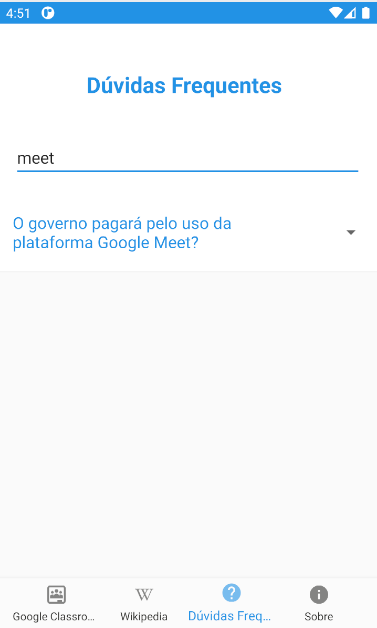

# Revisão

Tarefa | Finalizada? |
:-----:|:-----------:|
[Ferramenta de busca no FAQ](https://github.com/GCES-Escola-em-Casa-2020-2/wiki/issues/19) | :heavy_check_mark: |
[Refatoração do NavigationView](https://github.com/GCES-Escola-em-Casa-2020-2/wiki/issues/8) | |

## Ferramenta de busca no FAQ

Foi implementado um mecanismo de busca para facilitar a busca na tela de perguntas e respostas frequente. Essa issue ficou como dívida técnica após a sprint 4. Após algumas tentativas de utilizar a toolbar disponível na biblioteca androidx, trocamos para ferramenta o EditText, também presente na biblioteca, dispensando o Menu criado anteriormente. Na classe QuestionsActivity, o EditText foi instanciado e adicionado um Listener para monitorar as alterações nesse campo. Ainda nessa classe também foi criado um método para realizar a filtragem do texto inserido pelo usuário com os textos da página de perguntas e resposta.

### Página inicial do FAQ
 
### Pesquisa no FAQ
 

## Histórico de Revisão

Data | Versão | Descrição | Autor |
:---:|:------:|-----------|-------|
13/05|0.1 | Documentação da ferramenta de busca no FAQ | [Rafael Ribeiro](https://github.com/rafaelflarrn) e [Lucas Gomes](https://github.com/LGomees) |

