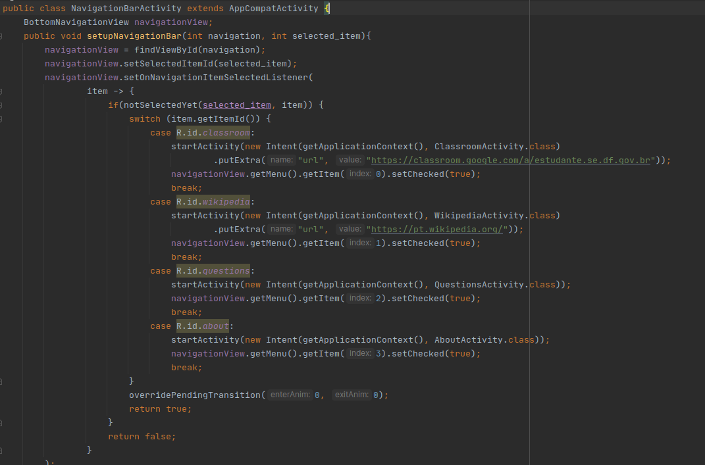

# Revisão

Tarefa | Finalizada? |
:-----:|:-----------:|
[Ferramenta de busca no FAQ](https://github.com/GCES-Escola-em-Casa-2020-2/wiki/issues/19) | :heavy_check_mark: |
[Refatoração da NavigationBar](https://github.com/Escola-em-Casa/android-escola-em-casa/issues/71) | |
[Mudando o tamanho da logo na SplashScreen]() | :heavy_check_mark: |

## Ferramenta de busca no FAQ

Foi implementado um mecanismo de busca para facilitar a busca na tela de perguntas e respostas frequente. Essa issue ficou como dívida técnica após a sprint 4. Após algumas tentativas de utilizar a toolbar disponível na biblioteca androidx, trocamos para a ferramenta o EditText, também presente na biblioteca, dispensando o Menu criado anteriormente. Na classe QuestionsActivity, o EditText foi instanciado e adicionado um Listener para monitorar as alterações nesse campo. Ainda nessa classe também foi criado um método para realizar a filtragem do texto inserido pelo usuário com os textos da página de perguntas e respostas.

### Página inicial do FAQ

### Pesquisa no FAQ

## Mudando o tamanho da logo na SplashScreen

Alteramos o tamanho da logomarca do Escola em casa na tela de carregamento inicial para uma melhor experiência do usuário.

## Refatoração da NavigationBar

Foi criada uma pai NavigationBar que é herdada por todas as outras activities. Dentro dessa classe pai é implementado o método de seleção dos itens da navbar evitando assim duplicação de código. 

## Histórico de Revisão

Data | Versão | Descrição | Autor |
:---:|:------:|-----------|-------|
13/05|0.1 | Documentação da ferramenta de busca no FAQ | [Rafael Ribeiro](https://github.com/rafaelflarrn) e [Lucas Gomes](https://github.com/LGomees) |
13/05|0.2 | Mudando o tamanho da logo na SplashScreen | [Lucas Gomes](https://github.com/LGomees) |

